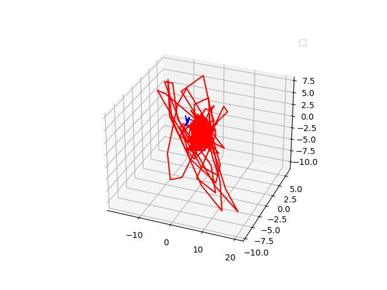
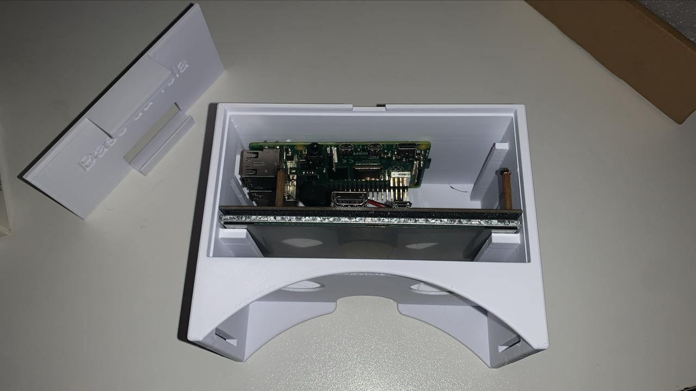

# Óculos VR de Baixo Custo 🕶️🏗️

> **Laboratório de Laboratório de Visualização, Interação e Simulação (LVIS)**  
> **Departamento de Engenharia Civil**  
> **Universidade de Brasília (UnB)**

Este repositório contém a documentação, os arquivos de modelagem e o código-fonte para o desenvolvimento de um protótipo de Óculos de Realidade Virtual de baixo custo. O projeto foi idealizado e construído por alunos da UnB para aplicação em visualização de modelos BIM, segurança do trabalho e simulações de canteiros de obras.

---

## 🎯 Objetivos do Projeto

* **Acessibilidade:** Reduzir o custo de adoção de tecnologias imersivas na construção civil.
* **Educação:** Permitir que estudantes e profissionais visualizem projetos em escala 1:1.
* **Inovação:** Integrar ferramentas de código aberto com hardware acessível.

---

## 🛠️ Especificações Técnicas

### Hardware Utilizado
* **Estrutura:** Modelagem impressa em 3D
* **Ópticas:** Lentes biconvexas.
* **Display/Processamento:** Integração com hardware desenvolvido via giroscópio interno e tela LCD acoplada ao microcontrolador.
* **Rastreamento:** Sensores IMU (MPU6050) integrados.

### Softwares e Ferramentas
* **Modelagem 3D:** Blender.
* **Game Engine:** Unity

---

## 📂 Estrutura do Repositório


```text
├── /hardware       # Arquivos STL para impressão 3D e esquemas de circuitos
├── /software       # Códigos de rastreamento e integração
├── /unity          # Cenários de teste desenvolvidos na Unity
├── /docs           # Manuais de montagem, relatórios e artigos científicos
└── README.md       # Este arquivo informativo
```

---

## 👨‍💻 Sobre o projeto

DADOS DA MPU



PROJETO



## 🚀 Como Iniciar

Ainda em desenvolvimento

---

## 👥 Autores e Contribuidores

Projeto desenvolvido pelos alunos do LVIS - UnB:

* Nome do Aluno 1 - GitHub: https://github.com - E-mail
* Nome do Aluno 2 - GitHub: https://github.com - E-mail
* Orientador: Prof. Dr. Nome do Orientador

---

## 📄 Licença

Ainda pedirei licença, POR FAVOR!!!
