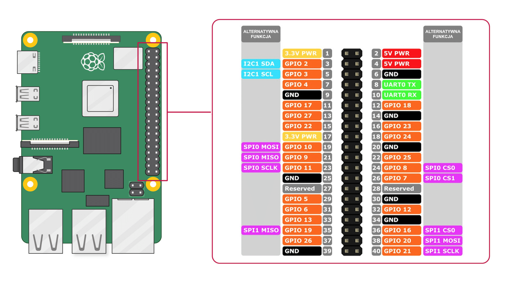

# Captação de Movimentação

Este projeto realiza a leitura, processamento e exibição de dados de movimento (aceleração e rotação) utilizando o sensor **MPU6050** conectado diretamente a um **Raspberry Pi**.

## 📋 Sobre o Projeto

O objetivo é coletar dados em tempo real do sensor MPU6050 (Acelerômetro e Giroscópio de 6 eixos) utilizando o protocolo de comunicação **I2C**. O código foi desenvolvido em C# e serve como base para Movimentação de cabeça do jogador.

### 🛠️ Componentes Utilizados

*   **Mini-computador:** Raspberry Pi
*   **Sensor:** MPU6050 (GY-521)
*   **Protocolo:** I2C (Endereço padrão: `0x68`)
*   **Linguagem Principal:** C#

---

## 🔌 Circuito e Pinagem (Hardware)

Para que o Raspberry Pi se comunique com a MPU6050, as conexões físicas devem ser feitas nos pinos GPIO do Pi conforme a tabela abaixo:

| MPU6050 (GY-521) | Raspberry Pi (Pino Físico) | Função |
| :---: | :---: | :---: |
| **VCC** | Pino 2 ou 4 (5V) ou Pino 1 (3.3V) | Alimentação |
| **GND** | Pino 6, 9 ou 14 (GND) | Terra |
| **SCL** | Pino 5 (GPIO 3 / SCL) | Clock do I2C |
| **SDA** | Pino 3 (GPIO 2 / SDA) | Dados do I2C |

> ⚠️ **Nota:** Os pinos INT (Interrupção) e AD0 (Seleção de endereço) não são obrigatórios para leituras básicas e podem ficar desconectados.


## 👨‍💻 Sobre o projeto

PINAGEM


---

## ⚙️ Configuração e Permissões no LineageOS

Para que o ambiente Android consiga ler a porta física I2C do Raspberry Pi, são necessárias configurações especiais de segurança e permissões:

### 1. Ativar Acesso Root e ADB
1. No LineageOS, vá em `Configurações > Sobre o dispositivo`.
2. Toque em `Número da Versão` 7 vezes para liberar as **Opções do Desenvolvedor**.
3. Volte em `Sistema > Opções do Desenvolvedor`.
4. Ative a **Depuração ADB** (Android Debug Bridge).
5. Ative o **Acesso Root** (mude para *Aplicativos e ADB* ou use um gerenciador como o Magisk, dependendo da sua ROM).

### 2. Liberar Permissão do Barramento I2C (SELinux)
Por padrão, as políticas de segurança do Android (SELinux) bloqueiam o acesso direto a dispositivos `/dev/`. Se o seu aplicativo reportar erro de "Permission Denied", execute via terminal ADB:
```bash
adb shell
su
setenforce 0
chmod 666 /dev/i2c-1
```
*(Nota: `setenforce 0` coloca o SELinux em modo permissivo temporariamente para testes de desenvolvimento).*

---

### Verificando a Conexão do Sensor

Após reiniciar e conectar os cabos, instale as ferramentas I2C para testar se o sensor foi reconhecido:
```bash
sudo apt-get install -y i2c-tools
```
Execute o comando de varredura (use `1` para Pi 2, 3, 4 e 5; use `0` para os modelos originais muito antigos):
```bash
i2cdetect -y 1
```
Se tudo estiver correto, você verá o endereço **68** impresso na tabela do terminal.

---


## 📊 Estrutura dos Dados Coletados

O script lê e processa os dados brutos do registrador da MPU6050, entregando as seguintes métricas no terminal ou arquivo de log:

*   **Acelerômetro (X, Y, Z):** Medido em $m/s^2$ ou força G ($g$). Identifica inclinação e aceleração linear.
*   **Giroscópio (X, Y, Z):** Medido em graus por segundo (°/s). Identifica a velocidade angular (velocidade de rotação).
*   **Temperatura:** Sensor interno integrado para monitoramento do chip em graus Celsius (°C).

---

## ✒️ Autores

*   **Seu Nome** - *Desenvolvimento do Circuito e Código* - [@seu-usuario](https://github.comseu-usuario)

---
